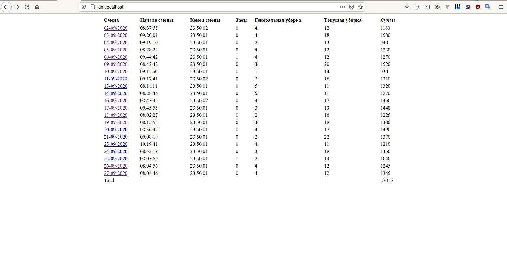
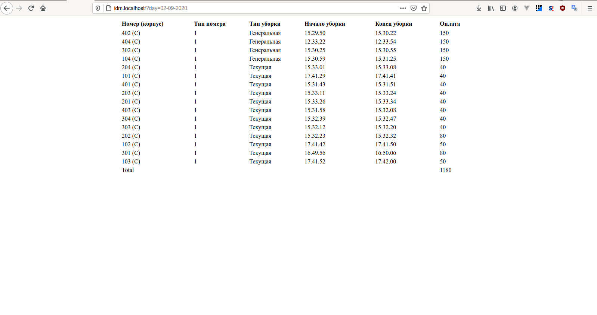

# Отчеты о работе Чистых Елены

## Программное обеспечение сервера

Для успешного запуска необходим локальный или публичный хостинг на котором установлены:
- PHP 8.0-dev-4.21.0
- Nginx  1.19-5.13.1
- MariaDB 10.5-3.12.1

## Просмотр отчетов

При входе на сайт сразу открывается отчет о работе за месяц с указанием объема работ и оплаты за каждый день.

Чтобы получить подробные сведения за день необходимо кликнуть по дате в первом столбце.

Скриншот главного отчета

Скриншот отчета за смену

